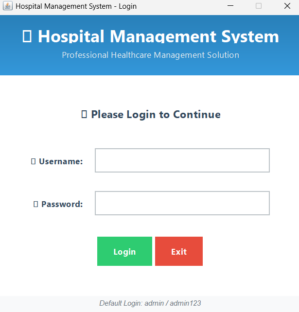
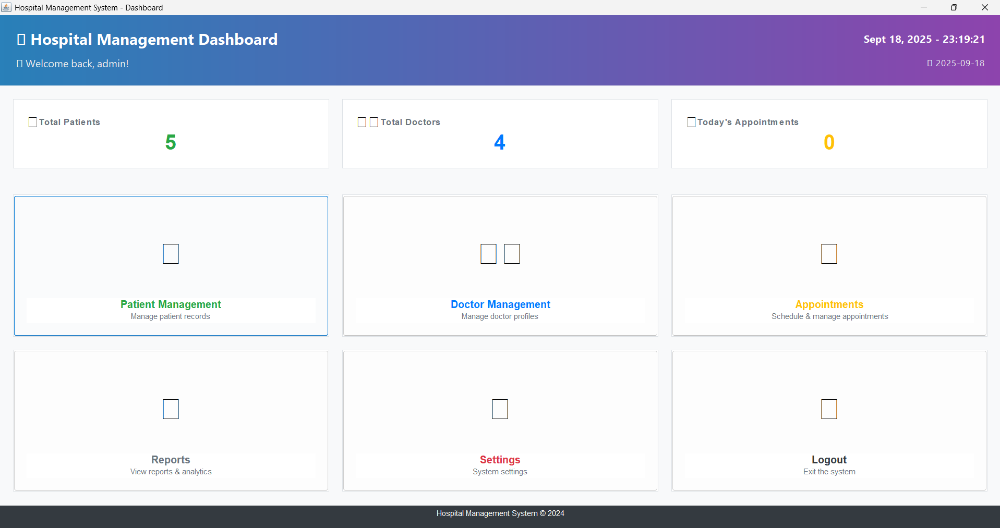
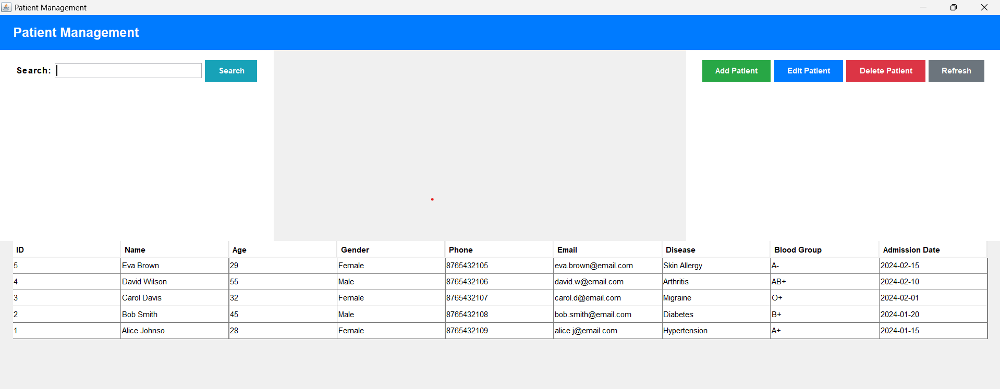
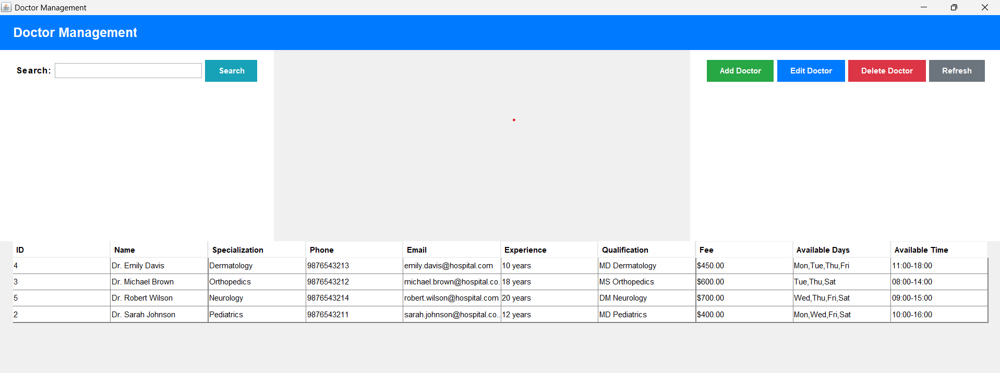
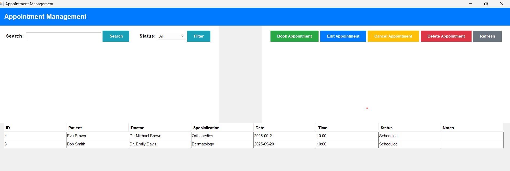
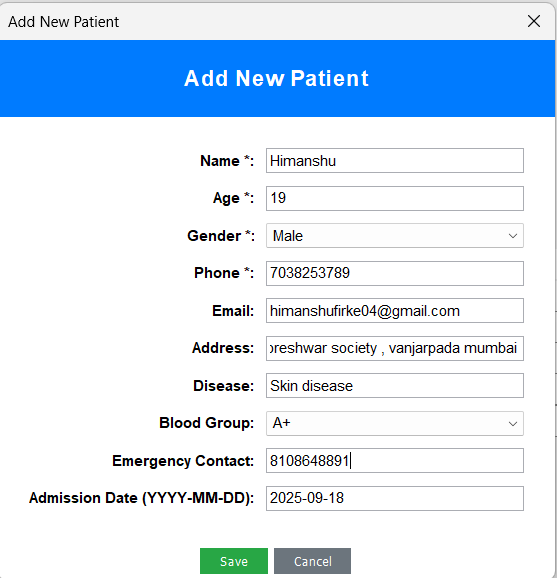
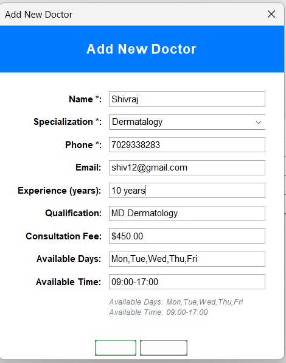

# 🏥 Hospital Management System

[](https://www.oracle.com/java/)
[](https://www.mysql.com/)
[](https://docs.oracle.com/javase/tutorial/uiswing/)
[](LICENSE)

A comprehensive, modern **Hospital Management System** built with Java Swing and MySQL. This application provides a complete solution for managing hospital operations including patient records, doctor profiles, appointment scheduling, and administrative tasks with an intuitive and professional user interface.

## 📸 Application Screenshots

### 🔐 Login Screen


*Modern gradient login interface with professional styling and enhanced security*

### 📊 Dashboard


*Real-time statistics dashboard with gradient header, live clock, and navigation cards*

### 👥 Patient Management


*Comprehensive patient records management with search, filter, and CRUD operations*

### 👨‍⚕️ Doctor Management


*Doctor profile management with specialization tracking and availability*

### 📅 Appointment Scheduling


*Advanced appointment booking system with real-time availability checking*

### 📝 Patient Registration


*User-friendly patient registration form with validation and modern UI*

### 🩺 Doctor Profile Creation


*Professional doctor profile creation with specialization and contact management*

## 🔹 Tech Stack

- **Frontend/Logic**: Java Swing (Modern UI Design)
- **Backend**: MySQL Database
- **Database Connection**: JDBC (Java Database Connectivity)
- **Architecture**: MVC Pattern with DAO Layer

## 🔹 Features

### ✅ Core Features
- **Patient Management**: Add, update, delete, and search patient records
- **Doctor Management**: Maintain doctor profiles with specializations and availability
- **Appointment Scheduling**: Book, update, and cancel appointments with availability checking
- **User Authentication**: Secure login system with role-based access
- **Modern UI**: Clean, intuitive Swing interface with professional styling
- **Data Persistence**: All records stored securely in MySQL database

### 🔄 Additional Features
- Real-time dashboard with statistics
- Search and filter functionality
- Doctor availability checking
- Appointment status management
- Data validation and error handling

## 🔹 Project Structure

```
HospitalManagementSystem/
├── database/
│   └── schema.sql                 # Database schema and sample data
├── src/main/java/com/hospital/
│   ├── Main.java                  # Application entry point
│   ├── dao/                       # Data Access Objects
│   │   ├── PatientDAO.java
│   │   ├── DoctorDAO.java
│   │   ├── AppointmentDAO.java
│   │   └── UserDAO.java
│   ├── model/                     # Entity classes
│   │   ├── Patient.java
│   │   ├── Doctor.java
│   │   ├── Appointment.java
│   │   └── User.java
│   ├── ui/                        # User Interface classes
│   │   ├── LoginFrame.java
│   │   ├── DashboardFrame.java
│   │   ├── PatientManagementFrame.java
│   │   ├── PatientDialog.java
│   │   ├── DoctorManagementFrame.java
│   │   ├── DoctorDialog.java
│   │   ├── AppointmentManagementFrame.java
│   │   └── AppointmentDialog.java
│   └── util/
│       └── DatabaseConnection.java # Database connection utility
└── README.md
```

## 🔹 Database Schema

### Tables
- **patients**: Patient information and medical records
- **doctors**: Doctor profiles with specializations and availability
- **appointments**: Appointment scheduling and management
- **users**: System users with authentication
- **bills**: Billing information (extensible)

## 🚀 Quick Start Guide

### 📋 Prerequisites
- ☑️ **Java JDK 17 or higher** ([Download here](https://www.oracle.com/java/technologies/downloads/))
- ☑️ **MySQL Server 8.0+** or **XAMPP** ([Download XAMPP](https://www.apachefriends.org/))
- ☑️ **MySQL Connector/J** ([Download here](https://dev.mysql.com/downloads/connector/j/))

### ⚡ Quick Setup (5 Minutes)

#### Step 1: Clone Repository
```bash
git clone https://github.com/yourusername/hospital-management-system.git
cd hospital-management-system
```

#### Step 2: Database Setup
```bash
# Start MySQL (XAMPP users: Start MySQL in XAMPP Control Panel)
# Open phpMyAdmin or MySQL Workbench

# Create database
CREATE DATABASE hospital_management;

# Import schema (via phpMyAdmin or command line)
mysql -u root -p hospital_management < database/schema.sql
```

#### Step 3: Download MySQL Connector
1. Download `mysql-connector-j-9.4.0.jar` from [MySQL official site](https://dev.mysql.com/downloads/connector/j/)
2. Place the JAR file in the project root directory
3. Ensure the filename matches what's in the batch files

#### Step 4: Configure Database (Optional)
If using different MySQL credentials, edit `src/main/java/com/hospital/util/DatabaseConnection.java`:
```java
private static final String URL = "jdbc:mysql://localhost:3306/hospital_management";
private static final String USERNAME = "root";        // Your MySQL username
private static final String PASSWORD = "";            // Your MySQL password
```

#### Step 5: Run Application
```bash
# Windows (Double-click or run in Command Prompt)
.\run_with_connector.bat

# Linux/macOS (Create equivalent shell script)
chmod +x run_with_connector.sh
./run_with_connector.sh
```

### 🔑 Default Login Credentials
- **Username**: `admin`
- **Password**: `admin123`
- **Role**: Administrator

### 🎯 Alternative Setup Methods

#### Method 1: Using IDE (IntelliJ IDEA/Eclipse)
1. Import project as Java project
2. Add `mysql-connector-j-*.jar` to project libraries
3. Run `Main.java` class

#### Method 2: Manual Compilation
```bash
# Compile all Java files
javac -cp ".:mysql-connector-j-9.4.0.jar" -d build src/main/java/com/hospital/**/*.java

# Run application
java -cp ".:mysql-connector-j-9.4.0.jar:build" com.hospital.Main
```

## 🔹 How to Use

### 1. Login
- Launch the application
- Use default credentials or create new users
- System will verify database connection on startup

### 2. Dashboard
- View real-time statistics (total patients, doctors, today's appointments)
- Navigate to different modules using the menu cards
- Monitor system time and user information

### 3. Patient Management
- **Add Patient**: Click "Add Patient" and fill in the required information
- **Search**: Use the search bar to find patients by name or phone
- **Edit**: Select a patient and click "Edit Patient"
- **Delete**: Select a patient and click "Delete Patient" (with confirmation)

### 4. Doctor Management
- **Add Doctor**: Click "Add Doctor" and enter doctor details
- **Specializations**: Choose from predefined specializations or add custom ones
- **Availability**: Set available days and working hours
- **Search**: Find doctors by name or specialization

### 5. Appointment Scheduling
- **Book Appointment**: Select patient and doctor, choose date/time
- **Availability Check**: System checks doctor availability automatically
- **Status Management**: Track appointment status (Scheduled, Completed, Cancelled, No Show)
- **Filter**: View appointments by status or search by patient/doctor name

## 🔹 Key Features Explained

### Modern UI Design
- Professional color scheme with intuitive navigation
- Responsive layout with proper spacing and typography
- Hover effects and visual feedback
- Error handling with user-friendly messages

### Database Operations
- **CRUD Operations**: Complete Create, Read, Update, Delete functionality
- **Data Validation**: Input validation on both client and database level
- **Foreign Key Relationships**: Proper relational database design
- **Transaction Safety**: Error handling for database operations

### Appointment System
- **Conflict Prevention**: Automatic checking for doctor availability
- **Time Validation**: Prevents scheduling appointments in the past
- **Status Tracking**: Complete appointment lifecycle management
- **Search & Filter**: Easy appointment lookup and management

## 🔹 Sample Data

The system comes with pre-loaded sample data:
- 5 sample doctors across different specializations
- 5 sample patients with complete information
- Default admin user for system access

## 🔹 Extensibility

The system is designed for easy extension:
- **Billing Module**: Add billing and payment tracking
- **Reports**: Generate various reports and analytics
- **User Roles**: Extend role-based access control
- **Additional Modules**: Add pharmacy, lab tests, etc.

## 🔹 Learning Outcomes

This project demonstrates:
- **Object-Oriented Programming**: Proper use of classes, inheritance, and encapsulation
- **Database Integration**: JDBC usage for database connectivity
- **GUI Development**: Modern Swing interface design
- **Software Architecture**: MVC pattern with DAO layer
- **Error Handling**: Comprehensive exception handling
- **Data Validation**: Input validation and business logic
- **Real-world Application**: Practical hospital management solution

## 🛠️ Troubleshooting

### ❌ Common Issues & Solutions

#### 1. **"ClassNotFoundException: com.mysql.cj.jdbc.Driver"**
```bash
# Solution: Ensure MySQL Connector JAR is in project root
ls mysql-connector-j-*.jar
# If missing, download from: https://dev.mysql.com/downloads/connector/j/
```

#### 2. **"Access denied for user 'root'@'localhost'"**
```sql
-- Solution: Reset MySQL password or check credentials
ALTER USER 'root'@'localhost' IDENTIFIED BY 'newpassword';
FLUSH PRIVILEGES;
```

#### 3. **"Table 'hospital_management.patients' doesn't exist"**
```bash
# Solution: Import database schema
mysql -u root -p hospital_management < database/schema.sql
```

#### 4. **"Connection refused" or "Port 3306 already in use"**
```bash
# Solution: Start MySQL service or check port
# XAMPP: Start MySQL in XAMPP Control Panel
# Windows Service: net start mysql80
# Check port: netstat -an | findstr 3306
```

#### 5. **Application won't start**
```bash
# Check Java version
java -version
# Should be 17 or higher

# Verify classpath
echo %CLASSPATH%
# Should include mysql-connector-j-*.jar
```

### 🔧 Performance Tips
- **Database Indexing**: Indexes are already optimized in schema
- **Memory**: Allocate more RAM if handling large datasets: `java -Xmx2g`
- **Connection Pooling**: Current implementation uses single connections (suitable for small-medium usage)

## 🔹 Resume Summary

**Hospital Management System (Java + MySQL)** – Developed a comprehensive CRUD-based application using JDBC to manage patients, doctors, and appointments. Implemented OOP concepts, modern Swing UI, SQL operations, and MVC architecture to automate hospital record-keeping with real-time dashboard and advanced search functionality.

## 🚀 Future Enhancements

### 🌐 Planned Features
- [ ] **Web Interface**: Spring Boot REST API
- [ ] **Mobile App**: React Native companion app
- [ ] **Advanced Reports**: PDF generation with charts
- [ ] **Email Notifications**: Appointment reminders
- [ ] **Billing Module**: Complete invoicing system
- [ ] **Inventory Management**: Medical supplies tracking
- [ ] **Multi-language Support**: Internationalization
- [ ] **Cloud Deployment**: AWS/Azure integration

### 🔧 Technical Improvements
- [ ] **Unit Testing**: JUnit test coverage
- [ ] **Docker Support**: Containerization
- [ ] **CI/CD Pipeline**: GitHub Actions
- [ ] **API Documentation**: Swagger/OpenAPI
- [ ] **Performance Monitoring**: Application metrics
- [ ] **Security Enhancements**: OAuth2, JWT tokens

## 📞 Support & Contact

### 🐛 Found a Bug?
1. Check [existing issues](https://github.com/yourusername/hospital-management-system/issues)
2. Create a [new issue](https://github.com/yourusername/hospital-management-system/issues/new) with:
   - Steps to reproduce
   - Expected vs actual behavior
   - Screenshots (if applicable)
   - System information

### 💡 Feature Requests
We welcome feature suggestions! Please create an issue with the `enhancement` label.

### 📧 Contact
- **GitHub**: [@yourusername](https://github.com/yourusername)
- **Email**: your.email@example.com
- **LinkedIn**: [Your Profile](https://linkedin.com/in/yourprofile)

## 🤝 Contributing

### How to Contribute
1. **Fork** the repository
2. **Create** a feature branch: `git checkout -b feature/amazing-feature`
3. **Commit** changes: `git commit -m 'Add amazing feature'`
4. **Push** to branch: `git push origin feature/amazing-feature`
5. **Open** a Pull Request

### Development Guidelines
- Follow Java naming conventions
- Add JavaDoc comments for public methods
- Include unit tests for new features
- Update README for significant changes

## 📄 License

This project is licensed under the **MIT License** - see the [LICENSE](LICENSE) file for details.

```
MIT License

Copyright (c) 2024 Hospital Management System

Permission is hereby granted, free of charge, to any person obtaining a copy
of this software and associated documentation files (the "Software"), to deal
in the Software without restriction, including without limitation the rights
to use, copy, modify, merge, publish, distribute, sublicense, and/or sell
copies of the Software, and to permit persons to whom the Software is
furnished to do so, subject to the following conditions:

The above copyright notice and this permission notice shall be included in all
copies or substantial portions of the Software.
```

## 🙏 Acknowledgments

- **Java Swing** for the robust GUI framework
- **MySQL** for reliable database management
- **XAMPP** for easy local development setup
- **IntelliJ IDEA** for excellent Java development experience
- **GitHub** for version control and project hosting

---

<div align="center">

### ⭐ Star this repository if you found it helpful!

[](https://github.com/yourusername/hospital-management-system/stargazers)
[](https://github.com/yourusername/hospital-management-system/network)

[🐛 Report Bug](https://github.com/yourusername/hospital-management-system/issues) • [✨ Request Feature](https://github.com/yourusername/hospital-management-system/issues) • [📖 Documentation](https://github.com/yourusername/hospital-management-system/wiki)

**Built with ❤️ using Java & MySQL**

</div>

---

**Last Updated**: September 2024 | **Version**: 1.0.0
